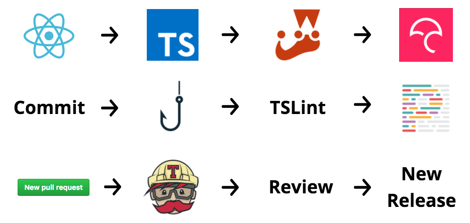

# How to Contribute

Thank you for taking your time to consider contributing to the repository!

To get started, follow the instructions in this document.

## Report a bug fix

To report a bug fix, follow the issue template found when openning a new issue, if possible and available attach a [codesandbox](https://codesandbox.io/) or [jsBin](https://codesandbox.io/) with the error being reported.

## Propose a Feature

Open a issue, mark as other, and describe the current scenario, it's problems, and how your resource solves a problem or introduce new functionalities.

## Choose a Task on the Project

Choose a task in the [project](https://github.com/agrotis-io/vraw/projects/1), read the description of the issue and if you have any questions, leave a comment.

## Issue Labeling

To identify what kind of issue you are planning to work, or to check our list of tasks and issues in more detail take a look at this table:

| Label            | Description                                                        |
| ---------------- | ------------------------------------------------------------------ |
| docs             | Indicate documentation development necessary                       |
| feat             | Indicate feature development                                       |
| CI               | Indicate Continuous integration development                        |
| refactor         | Indicate code refactor                                             |
| remove           | Indicate feature removal                                           |
| fix              | Indicates an unexpected problem or unintended behavior             |
| duplicate        | Indicates similar issues or pull requests                          |
| enhancement      | Indicates new feature requests                                     |
| good first issue | Indicates a good issue for first-time contributors                 |
| help wanted      | Indicates that a maintainer wants help on an issue or pull request |
| invalid          | Indicates that an issue or pull request is no longer relevant      |
| question         | Indicates that an issue or pull request needs more information     |
| wontfix          | Indicates that work won't continue on an issue or pull request     |

## Fork or Clone It

In order to start colaborating to our project, you have to **FORK** this repository if you are a contributor, or **CLONE** it if you are a not a contributor.

## Development Workflow

This will help you understand how you should develop your contribution to the repository:

## Install Dependencies

After getting the repository locally in your machine, you have to install all the dependencies in order to run and start contributing.

To install everything you need, go to the folder you cloned the repository and run: _yarn install_

## Testing your Component

If your contribution is a new component, or a modification in an existing one, you might test it's final UI version with Storybook.

To test the component, type this command in the project's folder location: _yarn run storybook_
After running the command, go to localhost:6006 in your favorite browser and look for the component you created or changed

## Branch Organization

Our branches must be created using the name suggested in the description of the issue, which should only be sent to the remote repository.

The branch names follow the rule: _issue\_ [number_of_issue] - [title_of_issue]_

> ex: issue_3-update_contributing

## Commit and Push

After creating a new branch, the next step is commiting your changes to the remote branch.

The process here is a litlle bit different (as you could see in our development workflow) of a regular commit and push approach.

Add the files you want to commit, and type the following command: _yarn run commit_

Carefully read and follow the instructions to finish your commit.

After commiting, push to the remote branch you previously created: _git push origin my-new-branch_

## Pull Request

Last but not least, verify if your chnages were pushed to your remote branch.

If everything is as expected, create a new pull request at GitHub.
